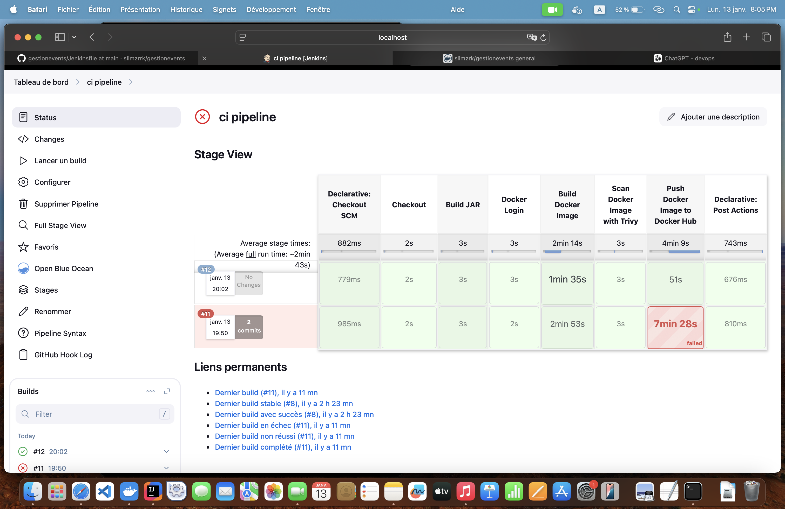
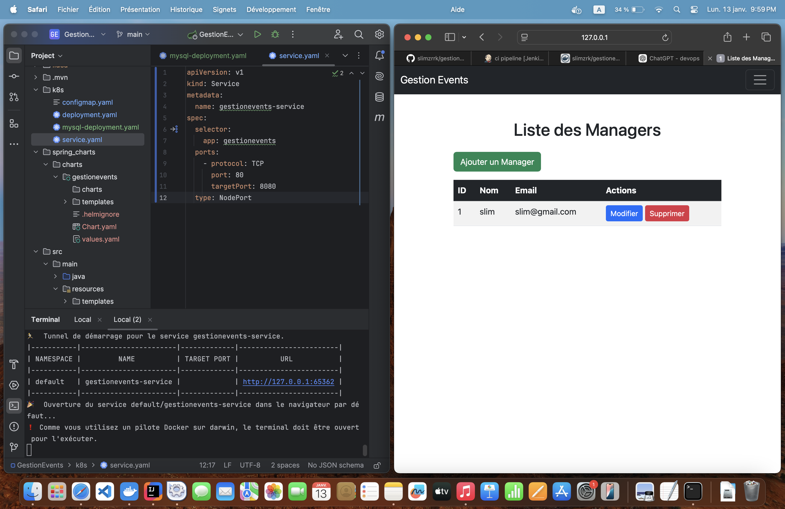

# Spring Boot DevOps Project

This project demonstrates a complete DevOps pipeline for a Spring Boot application, incorporating **Docker**, **Jenkins**, and **Kubernetes** for containerization, CI/CD, and deployment.

---

## Description

This repository contains a Spring Boot application that showcases how to streamline the development, testing, and deployment processes using modern DevOps tools.

---

## Pipeline Overview

The DevOps pipeline for this project includes the following steps:

1. **Build and Package**: The Spring Boot application is built and packaged as a JAR file using Maven.
2. **Containerization**: The application is containerized using Docker.
3. **CI/CD Automation**: Jenkins automates the continuous integration and deployment process.
4. **Kubernetes Deployment**: The containerized application is deployed and managed on a Kubernetes cluster.

---

## CI/CD Pipeline in Jenkins

Below is an overview of the Jenkins pipeline stages for this project:

![Jenkins CI/CD Pipeline](# Spring Boot DevOps Project

This project demonstrates a complete DevOps pipeline for a Spring Boot application, incorporating **Docker**, **Jenkins**, and **Kubernetes** for containerization, CI/CD, and deployment.

---

## Description

This repository contains a Spring Boot application that showcases how to streamline the development, testing, and deployment processes using modern DevOps tools.

---

## Pipeline Overview

The DevOps pipeline for this project includes the following steps:

1. **Build and Package**: The Spring Boot application is built and packaged as a JAR file using Maven.
2. **Containerization**: The application is containerized using Docker.
3. **CI/CD Automation**: Jenkins automates the continuous integration and deployment process.
4. **Kubernetes Deployment**: The containerized application is deployed and managed on a Kubernetes cluster.

---

## CI/CD Pipeline in Jenkins

Below is an overview of the Jenkins pipeline stages for this project:

The pipeline includes stages such as:
- Source Code Checkout
- Building the JAR file
- Docker Image Creation
- Docker Image Scanning with Trivy
- Pushing the Docker Image to Docker Hub
- Deploying the Application to Kubernetes

---

## Kubernetes Deployment

The application is deployed on a Kubernetes cluster with the following configuration:
- **Service**: Exposes the application to external traffic.
- **Deployment**: Ensures the application runs as multiple replicas for high availability.

Here is a screenshot showing the Kubernetes service and the application running:

The service is exposed using a NodePort, and the application is accessible via the provided URL.

---

## Features

- **Portability**: Docker ensures the application runs consistently across different environments.
- **Automation**: Jenkins automates the CI/CD processes.
- **Scalability**: Kubernetes enables high availability and scaling.
- **Security**: Trivy scans Docker images for vulnerabilities before deployment.

---

## How to Use

1. Clone the repository.
2. Follow the CI/CD pipeline in Jenkins.
3. Deploy the application on Kubernetes.
4. Access the application using the provided NodePort URL.

---

## Author

This project was developed as part of a DevOps practice for Spring Boot applications.

---

## License

This project is licensed under the MIT License. See the [LICENSE](LICENSE) file for more details.
)

The pipeline includes stages such as:
- Source Code Checkout
- Building the JAR file
- Docker Image Creation
- Docker Image Scanning with Trivy
- Pushing the Docker Image to Docker Hub
- Deploying the Application to Kubernetes

---

## Kubernetes Deployment

The application is deployed on a Kubernetes cluster with the following configuration:
- **Service**: Exposes the application to external traffic.
- **Deployment**: Ensures the application runs as multiple replicas for high availability.

Here is a screenshot showing the Kubernetes service and the application running:

The service is exposed using a NodePort, and the application is accessible via the provided URL.

---

## Features

- **Portability**: Docker ensures the application runs consistently across different environments.
- **Automation**: Jenkins automates the CI/CD processes.
- **Scalability**: Kubernetes enables high availability and scaling.
- **Security**: Trivy scans Docker images for vulnerabilities before deployment.

---

## How to Use

1. Clone the repository.
2. Follow the CI/CD pipeline in Jenkins.
3. Deploy the application on Kubernetes.
4. Access the application using the provided NodePort URL.

---

## Author

This project was developed as part of a DevOps practice for Spring Boot applications.

---

## License

This project is licensed under the MIT License. See the [LICENSE](LICENSE) file for more details.
